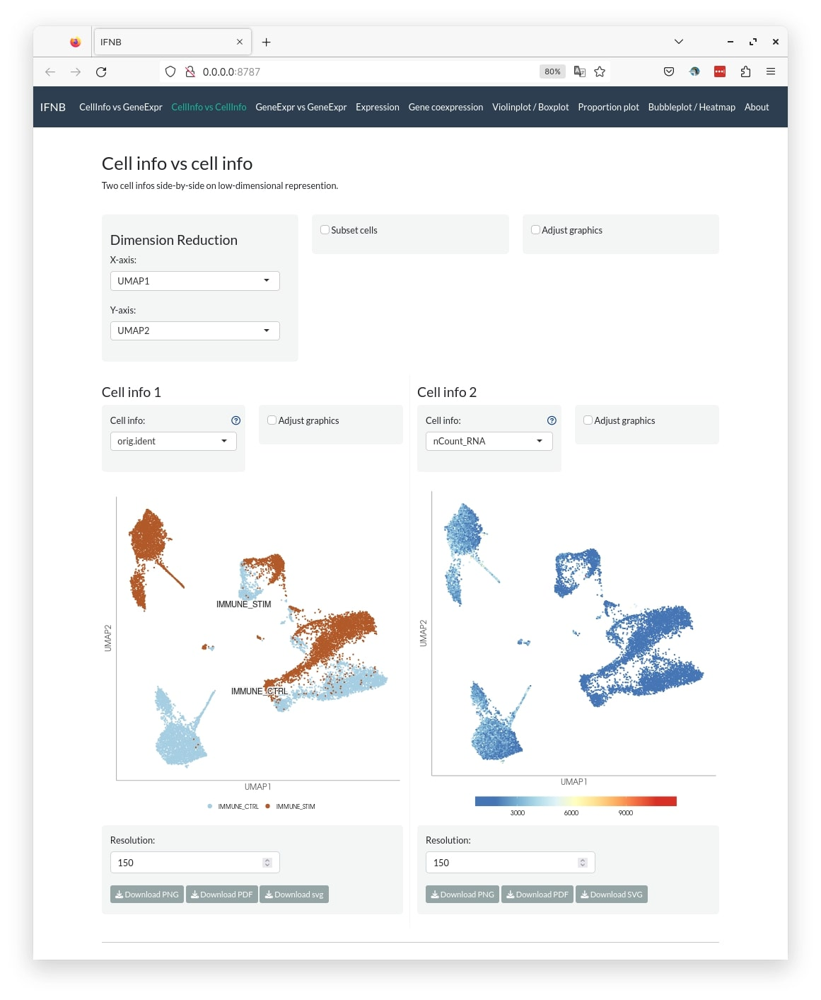
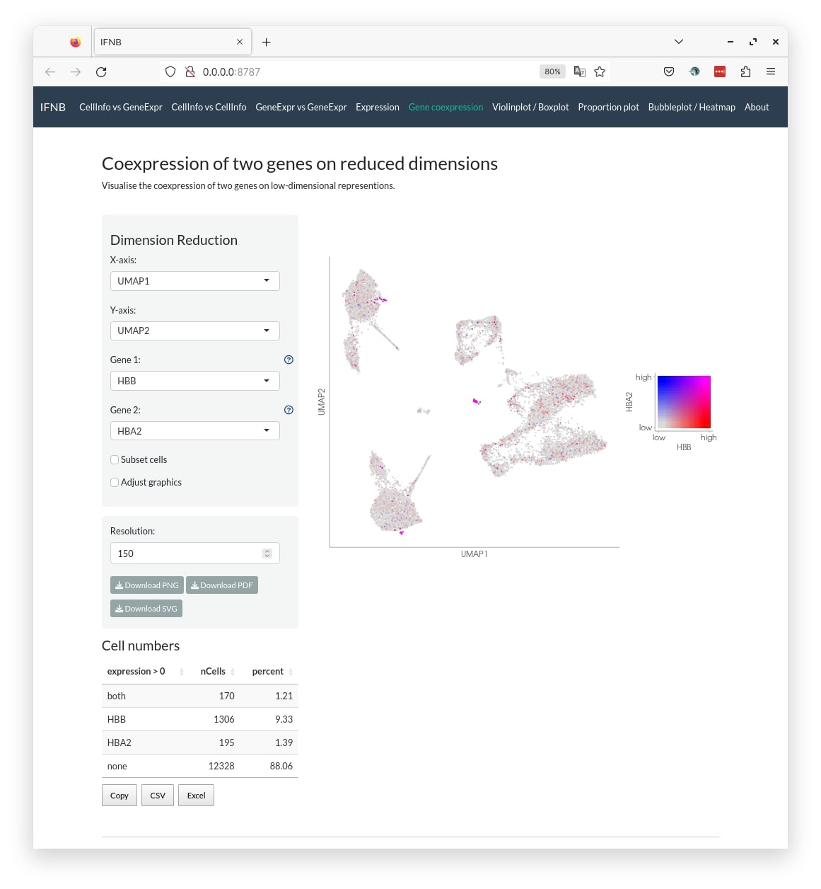

# easyshiny [](https://lifecycle.r-lib.org/articles/stages.html#experimental)

`easyshiny` is a R package to quickly create an interactive web application to visualise and explore single-cell data.

## Installation

Run the following code to check if the dependency packages are installed, else install them if required:

``` r
pkgs = c("bslib", "data.table", "DT", "ggdendro", "ggplot2", "ggplotify", "ggrepel", "glue", "grid", "hdf5r", "magrittr", "Matrix", "patchwork", "RColorBrewer", "readr", "remotes", "reticulate", "Seurat", "shiny", "shinycssloaders", "shinyhelper")

pkg = pkgs[!(pkgs %in% installed.packages()[,"Package"])]
if(length(pkg)){install.packages(pkg)}

# optional if you want to use custom fonts
install.packages("showtext")
 
# If you are using h5ad file as input, run the code below as well
# reticulate::py_install("anndata")
```

`easyshiny` can then be installed from GitHub as follows:

``` r
remotes::install_github("NBISweden/easyshiny")
```

For usage and deploy guide, see [here](https://nbisweden.github.io/easyshiny).

## Screenshots


*Single dataset*


*Multiple datasets*


*Cell information vs gene expression.*



*Cell information vs cell information.*


*Gene expression vs gene expression.*



*Gene co-expression.*


*Proportion plot.*


*Heatmap/Dotplot/Bubble plot.*


*Violin plot.*

## Acknowledgements

**easyshiny** is built on [ShinyCell](https://github.com/SGDDNB/ShinyCell). 

Ouyang, J. F., Kamaraj, U. S., Cao, E. Y., & Rackham, O. J. (2021). ShinyCell: simple and sharable visualization of single-cell gene expression data. [Bioinformatics, 37(19), 3374-3376](https://doi.org/10.1093/bioinformatics/btab209).

**easyshiny** was developed in collaboration with [Makinen Lab](http://www.makinenlab.com/). Thanks to [Taija Mäkinen](https://www.igp.uu.se/research/vascular-biology/taija-makinen/) and [Marle Kraft](https://www.katalog.uu.se/profile/?id=N19-1321) for their valuable contribution.

## Issues

Report issues [here](https://github.com/nbisweden/easyshiny/issues).

---

2023 • NBIS
