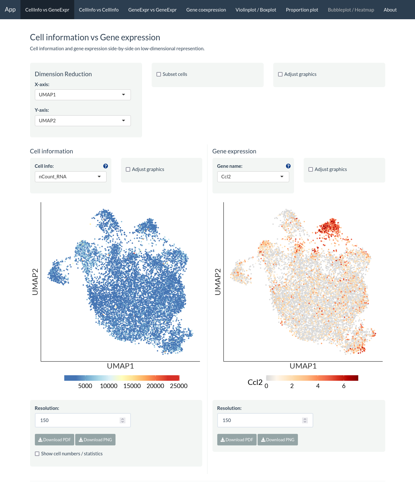
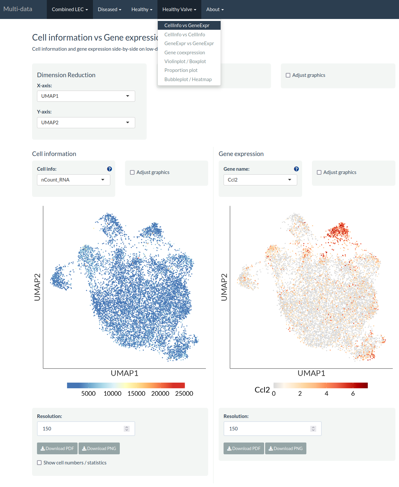

# easyshiny [](https://lifecycle.r-lib.org/articles/stages.html#experimental)

`easyshiny` is a R package to quickly create an interactive web application to visualise and explore single-cell data.

# Installation

Run the following code to check if the dependency packages required are installed, else install them if required:

``` r
reqPkg = c("data.table", "DT", "ggdendro", "ggplot2", "ggrepel", "glue", "grid", "hdf5r", "magrittr", "Matrix", "patchwork" ,"RColorBrewer", "readr", "remotes", "reticulate", "R.utils", "Seurat", "shiny", "shinyhelper", "showtext", "shinythemes", "shinycssloaders")

newPkg = reqPkg[!(reqPkg %in% installed.packages()[,"Package"])]
if(length(newPkg)){install.packages(newPkg)}

# If you are using h5ad file as input, run the code below as well
# reticulate::py_install("anndata")
```

`easyshiny` can then be installed from GitHub as follows:

``` r
remotes::install_github("royfrancis/easyshiny")
```

# Usage

To generate and launch the app using a **Seurat** file, run as shown below.

```r
library(easyshiny)
obj_conf = create_config(obj)
make_app(obj, obj_conf, gex.assay="RNA", gex.slot="data", gene.mapping = FALSE, shiny.title = "My Awesome App", shiny.dir="app")
shiny::runApp("app")
```



To use multiple Seurat datasets, see code below.

```r
obj1_conf = create_config(obj1)
make_file(obj1, obj1_conf, gex.assay="RNA", gex.slot="data", gene.mapping = FALSE, shiny.prefix = "sc1", shiny.dir="app")
obj2_conf = create_config(obj2)
make_file(obj2, obj2_conf, gex.assay="RNA", gex.slot="data", gene.mapping = FALSE, shiny.prefix = "sc2", shiny.dir="app")
make_code_multi(
  shiny.title = "Multi-data",
  shiny.prefix = c("sc1", "sc2"),
  shiny.headers = c("Label 1", "Label 2"),
  shiny.dir = "app")
shiny::runApp("app")
```



# More information

This project is forked from [ShinyCell](https://github.com/SGDDNB/ShinyCell). Go there to get more information on how to run, citation etc.
