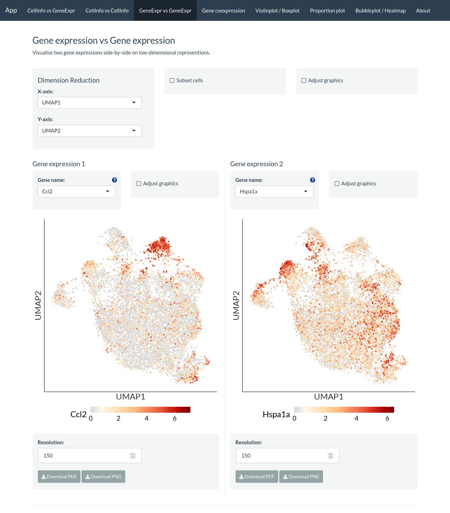
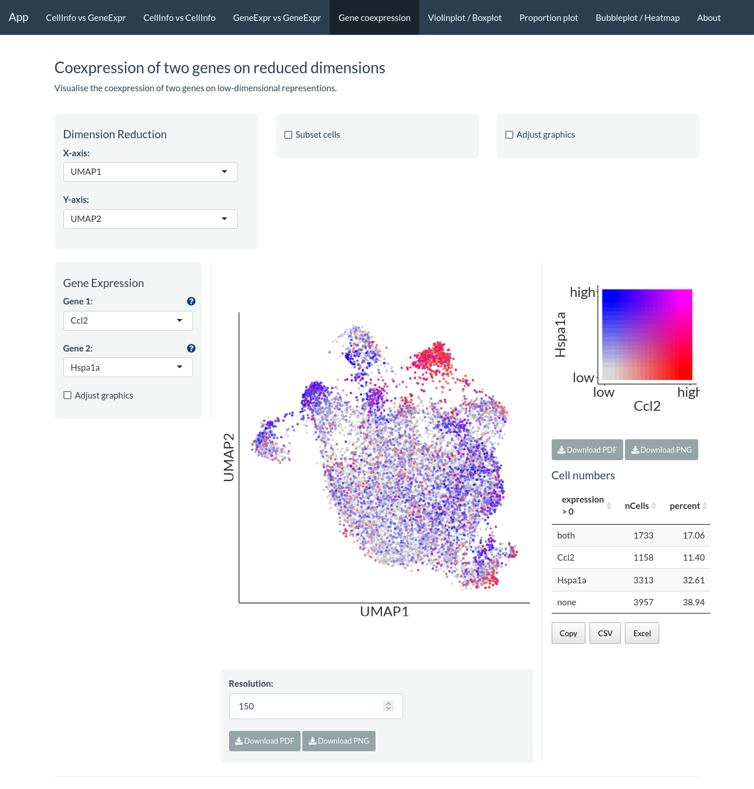
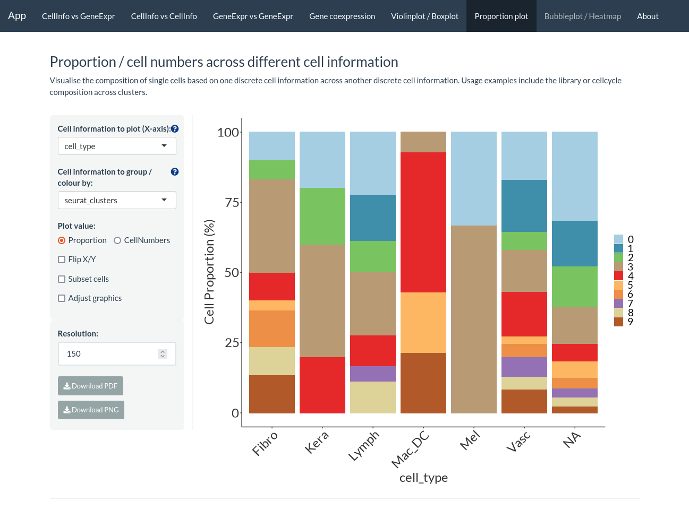
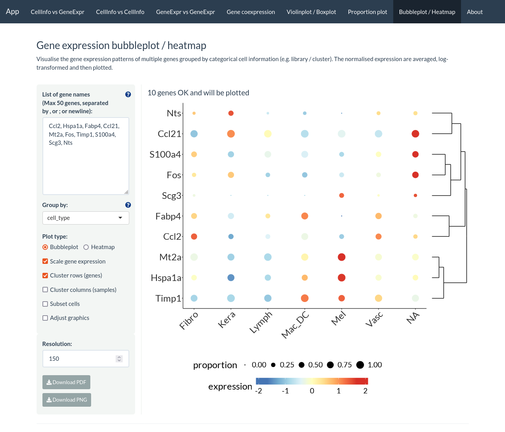
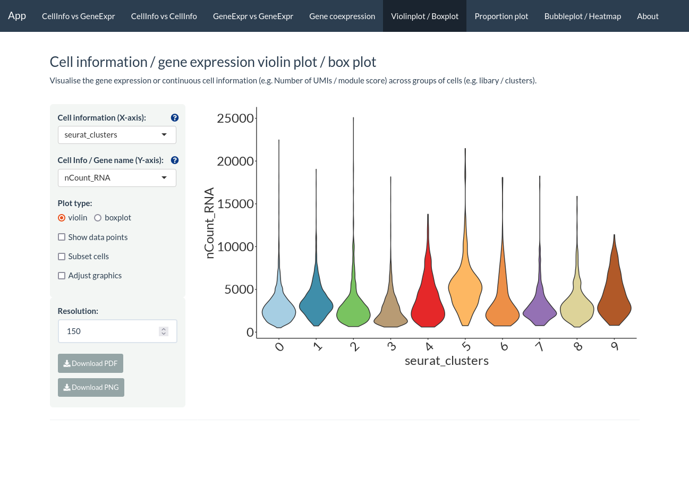

# easyshiny [](https://lifecycle.r-lib.org/articles/stages.html#experimental)

`easyshiny` is a R package to quickly create an interactive web application to visualise and explore single-cell data.

# Installation

Run the following code to check if the dependency packages required are installed, else install them if required:

``` r
reqPkg = c("data.table", "DT", "ggdendro", "ggplot2", "ggrepel", "glue", "grid", "hdf5r", "magrittr", "Matrix", "patchwork" ,"RColorBrewer", "readr", "remotes", "reticulate", "R.utils", "Seurat", "shiny", "shinyhelper", "shinythemes", "shinycssloaders", "showtext")

newPkg = reqPkg[!(reqPkg %in% installed.packages()[,"Package"])]
if(length(newPkg)){install.packages(newPkg)}

# If you are using h5ad file as input, run the code below as well
# reticulate::py_install("anndata")
```

`easyshiny` can then be installed from GitHub as follows:

``` r
remotes::install_github("royfrancis/easyshiny", ref="revamp")
```

# Usage

To generate and launch the app using a **Seurat** file, here is an example using built-in data from the Seurat package.

```r
library(easyshiny)
library(Seurat)
obj_conf = create_config(pbmc_small)
make_app(pbmc_small, obj_conf, gex.assay="RNA", gex.slot="data", gene.mapping = FALSE, shiny.title = "My Awesome App", shiny.dir="app")
shiny::runApp("app")
```


To use multiple Seurat datasets, see example using built-in data from the Seurat package. In this example, the same data is used for both datasets.

```r
obj1_conf = create_config(pbmc_small)
make_file(pbmc_small, obj1_conf, gex.assay="RNA", gex.slot="data", gene.mapping = FALSE, shiny.prefix = "sc1", shiny.dir="app")
obj2_conf = create_config(pbmc_small)
make_file(pbmc_small, obj2_conf, gex.assay="RNA", gex.slot="data", gene.mapping = FALSE, shiny.prefix = "sc2", shiny.dir="app")
make_code_multi(
  shiny.title = "Multi-data",
  shiny.prefix = c("sc1", "sc2"),
  shiny.headers = c("Label 1", "Label 2"),
  shiny.dir = "app")
shiny::runApp("app")
```


# Screenshots


Cell information vs gene expression.


Cell information vs cell information.



Gene expression vs gene expression



Gene co-expression.



Proportion plot.



Bubble plot.



Violin plot.

# Acknowledgements

This project is built on [ShinyCell](https://github.com/SGDDNB/ShinyCell). Go there to get more details and citation.

# Issues

Report issues [here](https://github.com/royfrancis/easyshiny/issues).

---

2022 • Roy Francis
