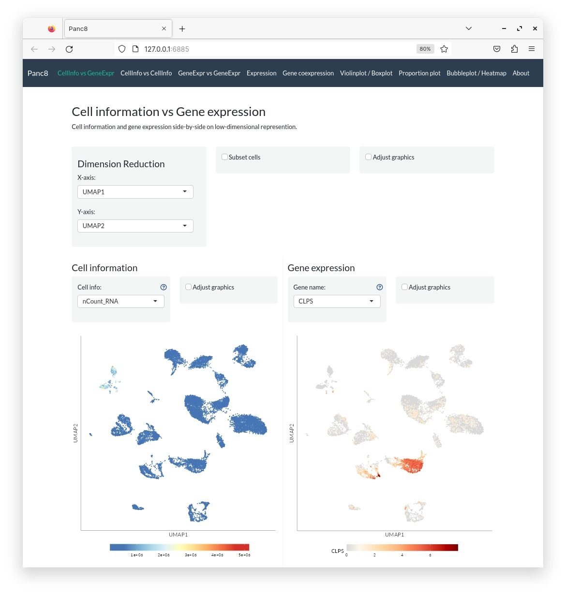
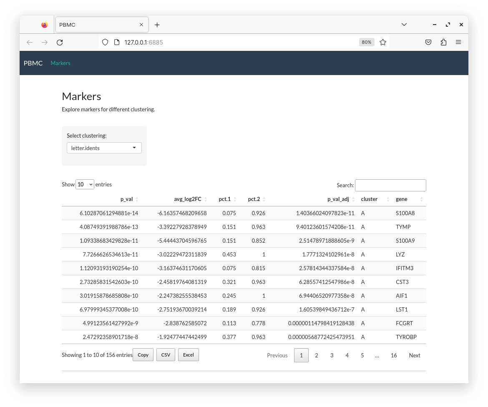

```{r setup, include=FALSE}
knitr::opts_chunk$set(echo = TRUE, eval = FALSE)
```

This vignette demonstrates the use of **easyshiny** package to create shiny web app from single-cell transcriptomic data.

## A small dataset

```{r,eval=TRUE,message=FALSE,warning=FALSE}
library(easyshiny)
library(Seurat)
```

In this example, we will use the built-in data that comes with Seurat.

```{r}
pbmc_small
```

```
An object of class Seurat 
230 features across 80 samples within 1 assay 
Active assay: RNA (230 features, 20 variable features)
 2 dimensional reductions calculated: pca, tsne
```

Since it has been already processed (normalisation, scaling, PCA, UMAP), we can proceed to building the app.

```{r}
pbmc_conf <- create_config(pbmc_small)
make_app(pbmc_small, pbmc_conf, gex.assay = "RNA", gex.slot = "data", shiny.title = "PBMC", shiny.dir = "pbmc")
```

This creates a directory called **pbmc** which contains the following files:

```{r}
list.files("pbmc")
```

```
pbmc
├── about.md
├── sc1conf.rds
├── sc1def.rds
├── sc1gene.rds
├── sc1gexpr.h5
├── sc1meta.rds
├── server.R
├── ui.R
└── www
    └── styles.css
```

To launch the app, run:

```{r}
shiny::runApp("pbmc")
```

**Tip!** Use `Rscript -e 'shiny::runApp("app",launch.browser=F)'` if running from the terminal.


## A larger dataset

We will now try a larger dataset using the **SeuratData** package.

```{r}
library(SeuratData)
obj <- LoadData("panc8")
obj
```

```
An object of class Seurat 
34363 features across 14890 samples within 1 assay 
Active assay: RNA (34363 features, 0 variable features)
```

Run basic processing including normalisation, scaling, PCA and UMAP.

```{r}
obj <- obj |>
  NormalizeData() |>
  ScaleData() |>
  FindVariableFeatures() |>
  RunPCA() |>
  RunUMAP(dims = 1:20)
```

```{r}
panc8_conf <- create_config(obj)
make_app(obj, panc8_conf, gex.assay = "RNA", gex.slot = "data", shiny.title = "Panc8", shiny.dir = "panc8")
shiny::runApp("panc8")
```



## Multiple datasets

Now we will look at an example using multiple datasets. We will use the same two datasets used above. Make sure both datasets have been pre-processed with UMAP.

```{r}
pbmc_conf <- create_config(pbmc_small)
make_file(pbmc_small, pbmc_conf, gex.assay="RNA", gex.slot="data", shiny.prefix = "sc1", shiny.dir="app")
panc8_conf <- create_config(obj)
make_file(obj, panc8_conf, gex.assay="RNA", gex.slot="data", shiny.prefix = "sc2", shiny.dir="app")
make_code_multi(
  shiny.title = "Multi-data",
  shiny.prefix = c("sc1", "sc2"),
  shiny.headers = c("PBMC", "Panc8"),
  shiny.dir = "app")
```

This will create a directory named **app** with the following files corresponding to both datasets:

```
app
├── about.md
├── sc1conf.rds
├── sc1def.rds
├── sc1gene.rds
├── sc1gexpr.h5
├── sc1meta.rds
├── sc2conf.rds
├── sc2def.rds
├── sc2gene.rds
├── sc2gexpr.h5
├── sc2meta.rds
├── server.R
├── ui.R
└── www
    └── styles.css
```

Launch the app.

```{r}
shiny::runApp("app")
```


## Options

We will take a look at some of the customisation options.

### Selective tabs

There are 9 different tabs that display different kinds of information. These are listed below:

|Tab  |Description                        |
|-----|-----------------------------------|
|civge|Cell info vs gene expression       |
|civci|Cell info vs cell info             |
|gevge|gene expression vs gene expression |
|gem  |Gene expression of multiple genes  |
|gec  |Gene co-expression                 |
|vio  |Violin plot                        |
|pro  |Proportion plot                    |
|hea  |Heatmap / Bubble / Dot plot        |
|mar  |Marker gene tables                 |
|about|About page and additional info     |

Of these, 8 tabs are displayed by default. Marker genes are not displayed by default. More on that below. Specific tabs can be displayed by setting the `tabs` argument. Tabs are displayed in the order in which they are provided.

```{r}
pbmc_conf <- create_config(pbmc_small)
make_app(pbmc_small, pbmc_conf, gex.assay="RNA", gex.slot="data", 
          shiny.title = "PBMC", shiny.dir="pbmc",
          tabs=c("civge","gem"))
shiny::runApp("pbmc")
```


### About page

The **about** page is a tab that is displayed by default. It contains acknowledgements by default and the user can modify it as needed. Markdown formatting is supported. The **about** page can be disabled by removing it from `tabs`. When multiple datasets are used, a common **about** page is created.

```{r}
# app without about page
pbmc_conf <- create_config(pbmc_small)
make_app(pbmc_small, pbmc_conf, gex.assay="RNA", gex.slot="data", shiny.title = "PBMC", shiny.dir="app", tabs=c("hea","vio"))
shiny::runApp("app")
```

### Marker genes

Marker gene functionality is only implemented for Seurat objects for now. To display marker genes, `Seurat::FindAllMarkers()` need to be run and resulting table added to the Seurat object slot `misc` as a named list. To simplify this, one can use this function:

```{r}
#' @description Find all markers by identity
#' @param obj Seurat v4 object
#' @param ids Column name to used as identity (one or more)
#' @param ... All arguments passed to Seurat::FindAllMarkers()
#' 
fam <- function(obj,ids=NULL,...){

  if(missing(obj)) stop("Seurat object not specified.")
  if(is.null(ids)) stop("Argument 'ids' is NULL. It must be one or more column names from metadata.")
  if(!is.character(ids)) stop("Argument 'ids' must be a character.")
  if(!"Seurat" %in% class(obj)) stop("Argument 'obj' must be a Seurat V4 object.")
  
  if(any(!ids %in% colnames(obj@meta.data))) {
    stop(paste("Following ids not found in metadata:",paste(ids[!ids %in% colnames(obj@meta.data)],collapse=",")))
  }

  fn <- function(id=NULL,obj,...){
    if(!is.null(id)) {
      if(!id %in% colnames(obj@meta.data)) stop(paste0("Following column does not exist: ",id,"."))
      Idents(obj) <- obj@meta.data[,id]
    }
    return(FindAllMarkers(obj,...))
  }
  
    return(setNames(lapply(ids,fn,obj=obj,...),ids))
}
```

One can compute marker genes for one or more metadata columns and resulting named list of marker tables are stored in `seurat@misc$markers`.

```{r}
# find marker genes for all levels in metadata column "letter.idents"
pbmc_small@misc$markers <- fam(pbmc_small,"letter.idents")

pbmc_conf <- create_config(pbmc_small)
make_app(pbmc_small, pbmc_conf, gex.assay="RNA", gex.slot="data", 
          shiny.title = "PBMC", shiny.dir="pbmc",
          tabs=c("mar"))
shiny::runApp("pbmc")
```



When using markers with multiple datasets, it is necessary to set `mar=TRUE` in `make_file()`.

```{r}
pbmc_small@misc$markers <- fam(pbmc_small, "letter.idents")

pbmc_conf1 <- create_config(pbmc_small)
make_file(pbmc_small, pbmc_conf1, gex.assay = "RNA", gex.slot = "data", shiny.prefix = "sc1", shiny.dir = "app", mar = TRUE)
pbmc_conf2 <- create_config(pbmc_small)
make_file(pbmc_small, pbmc_conf2, gex.assay = "RNA", gex.slot = "data", shiny.prefix = "sc2", shiny.dir = "app", mar = TRUE)
make_code_multi(
  shiny.title = "Multi-data",
  shiny.prefix = c("sc1", "sc2"),
  shiny.headers = c("PBMC 1", "PBMC 2"),
  shiny.dir = "app",
  tabs = c("civge", "civci", "gevge", "gem", "gec", "vio", "pro", "hea", "mar", "about"))
  shiny::runApp("app")
```

### Theme

Change the app theme to another [bootswatch theme](https://bootswatch.com/). by changing the argument `theme`. For more finer control over styling, edit the **www/styles.css** file after creating the app.

```{r}
pbmc_conf <- create_config(pbmc_small)
make_app(pbmc_small, pbmc_conf, gex.assay="RNA", gex.slot="data", 
          shiny.title = "PBMC", shiny.dir="pbmc", theme="united")
shiny::runApp("pbmc")
```


## Session

```{r,eval=TRUE,class.output="foldable"}
sessionInfo()
```

