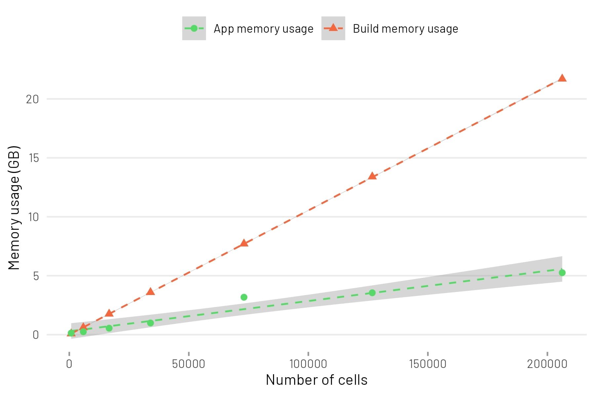

```{r setup, include=FALSE}
knitr::opts_chunk$set(echo = TRUE, eval = FALSE)
```

**easyshiny** is intended as quick solution for small to medium scale datasets. It is not built for hundred-thousands or million cell scale. For that, see [cellxgene](https://cellxgene.cziscience.com/), for example. In this vignette, we will look at RAM requirements and cell numbers.

A sample dataset with 400,000 cells was downsampled to different number of cells to evaluate memory usage. When building the app, the memory used was estimated using the `pryr::mem_change()` function. Once the app is built, it is run inside `profvis()` to estimate run time memory usage as follows:

```{r}
pv <- profvis({
    shiny::runApp("app", launch.browser = T)
})
htmlwidgets::saveWidget(pv, "app.html")
browseURL("app.html")
```

This table shows the number of cells in the downsampled dataset and the memory usage during build and runtime in GB.

|  cells| features| mem_build_gb| mem_app_gb|
|------:|--------:|------------:|----------:|
|    800|    26349|        0.083|  0.1367188|
|   5868|    26349|        0.604|  0.2490234|
|  16664|    26349|        1.760|  0.5507812|
|  33974|    26349|        3.590|  0.9912109|
|  73069|    26349|        7.710|  3.1748047|
| 126738|    26349|       13.400|  3.5537109|
| 206197|    26349|       21.700|  5.2568359|
| 403474|    26349|           NA|         NA|

The full 400,000 cell dataset could not be built on my system as it required more than 40GB of RAM.

This table is visualised as a scatterplot. A linear model was fitted to the points.



The build memory usage (in GB) can be estimated from the number of cells as follows:

```
build_memory_usage_gb = 5.003e-03 + (number_of_cells * 1.054e-04)
```

The app memory usage (in GB) can be estimated from the number of cells as follows:

```
app_memory_usage_gb = 2.912e-01 + (number_of_cells * 2.563e-05)
```

<p style="color: #8a6d3b;background-color: #fcf8e3;border-color:#faebcc;padding: 6px;border-radius: 4px;" style="inline-block">
&nbsp; <i class="fas fa-exclamation-circle"></i> &nbsp; It is unknown if the data can be extrapolated beyond the range. Also note that the sample data has 26349 features.
</p>

Apart from memory usage, it is worth noting that the usability of the app is also affected by CPU. On my system, roughly 100,000 cells was the limit of smooth interaction with widgets. Beyond that, the app was slow to respond and there was appreciable delay between widget adjustment and updating of plots.
